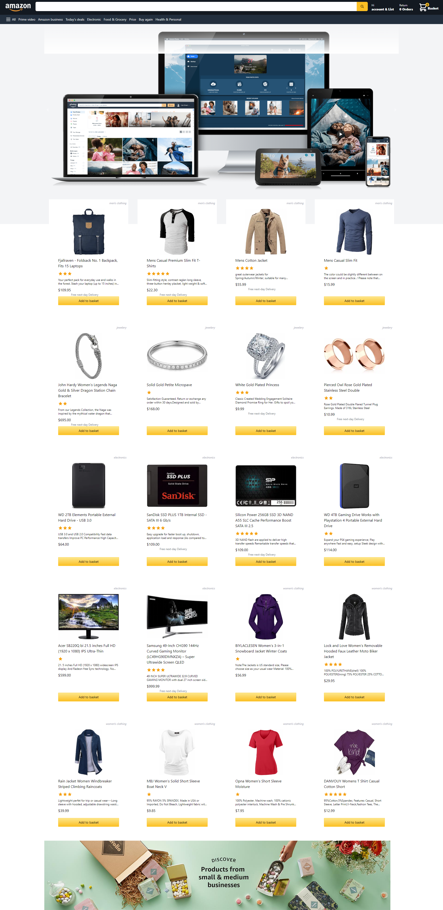
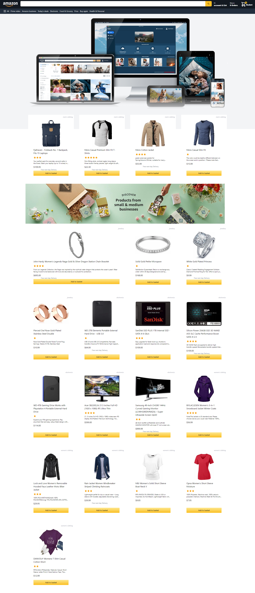

## About AmazonByNext.js
<hr>
AmazonByNext.js is a web application to make a shopping cart by Next.js and Tailwind CSS.
<hr>



## Install

###### To install the dependencies and start the app, run the following commands:
## Using npm

Run commands

1) ```npm install```


2) ```npm run dev```


## Or using yarn

Run commands

1) ```npm install --global yarn```

2) ```yarn install```

3) ```yarn run dev```

## Help <hr>

Please post any questions as an email to [Amir haghighi](mailto:haghighi251@gmail.com).

## AmazonByNext.js Sponsors
<hr>
 If you are interested in becoming a sponsor, please send an email me. haghighi251@gmail.com

## Contributing
<hr>
Thank you for considering contributing to the AmazonByNext.js ! please send an email me. haghighi251@gmail.com.

## Security Vulnerabilities
<hr>
If you discover a security vulnerability within AmazonByNext.js, please send an e-mail to Amir haghighi via haghighi251@gmail.com.
<br>All security vulnerabilities will be promptly addressed.

## License
<hr>
The AmazonByNext.js is open-sourced software licensed under the MIT license. You can see more info at hte link below:
https://opensource.org/licenses/MIT
